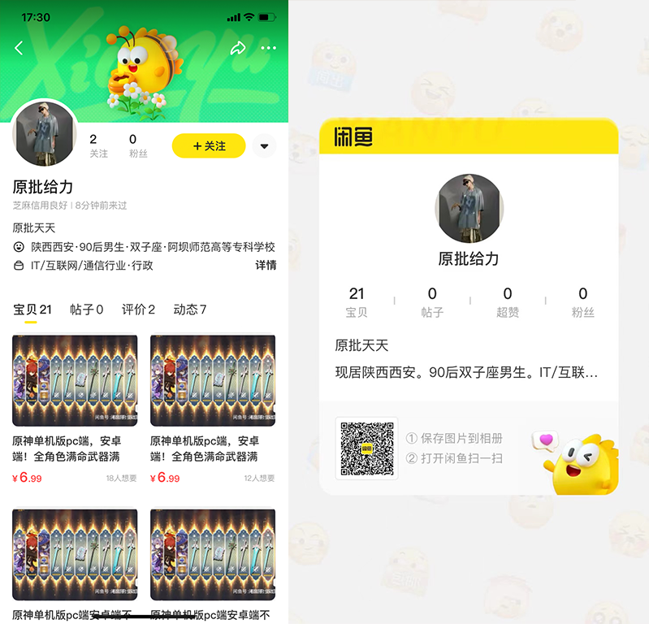

# GenshinProxy

## 目前发现有人盗卖，已经进行闭源处理！

# 使用教程

有 Xposed 环境请使用 `GenshinProxy-release.apk` 不支持 `EDXposed & 原版Xposed` 只支持 `LSPosed`

无 Xposed 环境请使用 `genshin-impact-308-lspatched.apk` 不支持`Android 9.0`以下设备!

第一次使用请填写服务器地址后进入官服下载资源

并保证浏览器能够打开你的服务器地址

若服务器未配置 `ssl` 证书请打开 `跳过SSL验证`

## 错误代码

- 4206 - 请打开 `强制模式`
- 出现多服列表 - `保证浏览器能够打开你的服务器地址`
- 网络错误 - `保证浏览器能够打开你的服务器地址`

# 赞助

# 狗墙

## 各位请见到一个举报一个！

